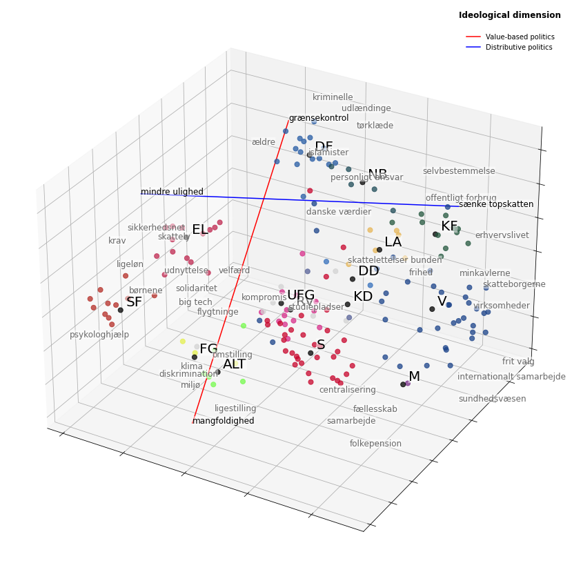

# Data Collection, Processing & Analysis (30 ECTS)

This repository contains scripts used in the DCPA course @ [SODAS, UCPH](https://sodas.ku.dk/).

I collect parliamentary transcripts, poltical tweets, and Meta ads, showing how this text corpus may be used to embed politicians in high-dimensional semantic space, infer party positions, and draw ideological scales.

My original motivation was the idea of identifying and describing of subdimensions of populist rhetoric employed by Danish politicians across various venues of communication.

This repo contains notebooks and utilites used in scraping, parsing, and wrangling the text data—as well as an example of politician/party embeddings. Please refer to my `politician2vec` repo [here](https://github.com/mathiasbruun/politician2vec) to explore the implementation of the underlying embedding functionality.

